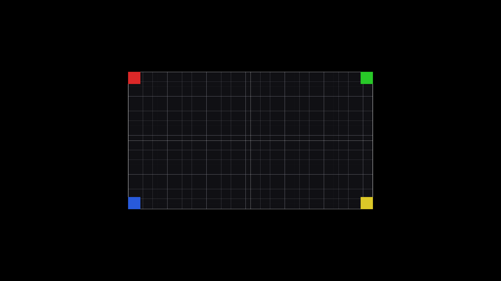
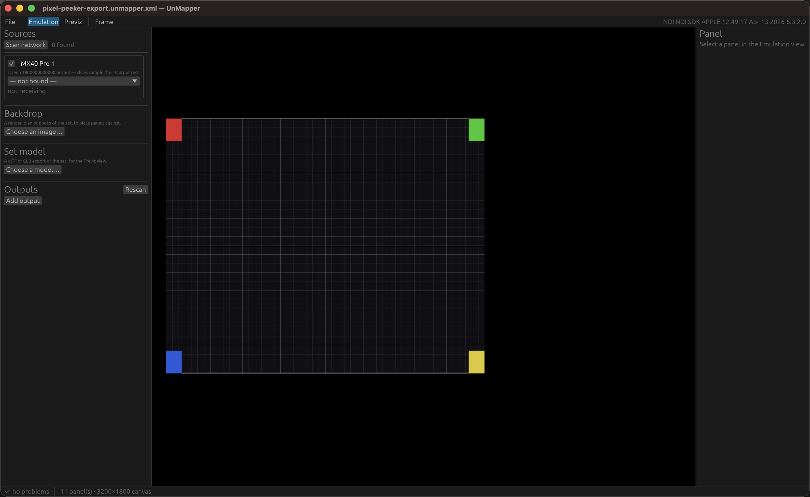

# UnMapper user guide

UnMapper **recreates a physical LED rig on the screens you actually have, and plays the real show
onto it**. It reads a Resolume Arena **Advanced Output** — the same slice map driving the real
wall — receives Resolume's outputs over **NDI**, and composites them onto a virtual
reconstruction of the rig.

Two views of one stage, and they are not alternatives:

- **Emulation** — the whole rig recreated flat, one canvas pixel per LED. Each connected display
  shows a cropped region, so a grid of monitors becomes the wall.
- **Previz** — the same panels at their positions in 3D, through a camera.



*An 11-panel rig in the previz view, rendered by `unmapper render --previz` — the same stage the
window further down is editing. Both views are fed by the same slice map and the same frames, so
what you see in one is what the other is showing.*

> **Before you rely on this:** the pipeline is built and verified end to end on real hardware — a
> real Arena 7.27 file, a live NDI sender at 50 fps, a real GPU — with the render paths checked
> by **pixel readback rather than by eye**.
>
> What that does not cover: **it has never run on a real LED wall or in a venue**, several GUI
> widgets are unexercised, and there is **no Syphon or Spout publishing, so NDI is the only way
> out**.
>
> Built with AI assistance.

---

## The workflow

The GUI is the intended way in:

```bash
cargo run -p unmapper-gui
```



*An 11-panel rig imported straight from a Resolume Advanced Output, with every source
defaulted to the built-in test pattern — no Resolume and no NDI sender involved. The source
reads "not bound / not receiving", which is what an offline layout session looks like.*

1. **Import** the Resolume Advanced Output file.
2. **Pick an NDI source** for each Resolume output.
3. **Drag the panels** into the shape of your rig.
4. **Save** the stage.

It also opens a stage directly:

```bash
cargo run -p unmapper-gui -- rig.unmapper.xml
```

Everything is available headlessly too — `sources`, `import`, `bind`, `check`, `render`:

```bash
cargo run -p unmapper-app -- sources
cargo run -p unmapper-app -- import "AdvancedOutput.xml" -o rig.unmapper.xml
cargo run -p unmapper-app -- bind rig.unmapper.xml --source 0 --ndi "STUDIO (Arena - Screen 1)"
cargo run -p unmapper-app -- render rig.unmapper.xml -o wall.png
cargo run -p unmapper-app -- render rig.unmapper.xml --previz -o previz.png --size 1280x720
```

---

## The one thing to get right

There are five coordinate spaces, and mixing two of them up is **the difference between a correct
wall and a plausible-looking wrong one**:

| Space | Units | Holds |
|---|---|---|
| **Composition** | px | Resolume's composition raster. A slice's `input` quad. |
| **Screen raster** | px | One Resolume output. A slice's `output` quad. |
| **Virtual raster** | px | UnMapper's emulation canvas — the whole rig, flat. A panel's `layout`. |
| **Stage** | metres | The physical set, Y up. A panel's `placement`. |
| **Display** | px | A connected monitor. An output's `region` crops the canvas into one. |

> **A slice's pixels live in *two* places, and which one to sample depends entirely on what the
> sender is sending.**
>
> - Resolume sending its **whole composition** → sample the slice's **`input`** quad.
> - Resolume sending **one feed per screen** (the usual show configuration) → that feed already
>   has the slicing applied, so sample the **`output`** quad.
>
> `SourceSpace` records which. Get it wrong and everything still renders — just wrongly.

---

## Working with nothing plugged in

A source does not have to be NDI. Two offline kinds exist so a rig can be laid out and checked
with no Resolume, no network and often no venue:

- **Test pattern** — a grid with four differently-coloured corners and a centre cross, sized to
  whatever the slice map says the screen is. **Because the corners differ, a slice that is
  flipped, rotated or sampling the wrong region is obvious at a glance** rather than
  plausible-looking.
- **Still** — any image, for laying a rig out against real artwork.

> The test pattern is a **geometry** aid, not a colour reference. Use
> [test-card](https://stoatworks-labs.com/software/) for colour.

---

## Describing the set

Two ways, and they are not alternatives — an operator with both should not have to choose.

**A 2D mockup** — a render, plan or photo of the display surface, sitting behind the panels on the
emulation canvas so they can be dragged onto the places they occupy in it.

> **It is an editing aid and never content.** The viewport draws it; the canvas that outputs crop
> from does not. Fade it with the opacity slider so panels stay readable over a busy render.

**A 3D set model** — glTF or GLB, from Blender, Cinema 4D, SketchUp or anything else. **Only
geometry is read**; materials, cameras and animation are ignored, because this is context for
judging where the walls sit, not a render. Nested node transforms are baked at load, so a truss
rotated inside a rig group arrives where the file says it is.

**CAD is usually in millimetres — there is a one-click `mm→m` button** for exactly that.

---

## Panel shapes

A panel is a **flat** rectangle unless you say otherwise, and most are — one physical LED tile is
rigid and flat. But UnMapper imports **one panel per slice**, and a slice routinely covers a whole
run of tiles: a curved upstage wall, a wrapped column, a folded corner. Those are exactly the rigs
the packed Advanced Output layout hides, and showing them flat is the thing previz is meant to fix.

Select a panel and pick its shape in the inspector.

**Arc** bends the panel about its vertical centre line. `Sweep°` is the total angle it subtends —
**positive sweeps both ends away from the audience**, which is the common concave wrap; negative
bulges towards them. The panel's **width is preserved as arc length**, so curving a wall does not
silently make it narrower, and the radius, chord and depth are reported beside the sweep so you
can check the shape against a drawing.

**Lattice** is the escape hatch for a shape no parameter describes — a fold, a stepped run,
something someone measured. Pick the number of columns and rows, then **drag the points in the
Previz view**: click one to select it, drag it to move it. A dragged point moves in the plane
facing the camera, so **orbit first, then drag** — the view you pull from is the view you pull in.
Fine values go in the inspector's X/Y/Z boxes, in panel-local metres with +Z towards the audience.

> **Changing shape keeps the shape.** Switching an arc to a lattice samples the arc, so the picture
> does not move; changing a lattice's columns or rows resamples it rather than starting again.
> Only **Flatten** and **Flat** throw the shape away.

> **A curved surface never reaches the emulation canvas.** Emulation stays flat and pixel-exact —
> one canvas pixel per LED — because that canvas is what stands in for the wall on a bank of
> monitors. Shape is previz's business, and only previz's.

---

## Outputs

The canvas is rendered **once** per frame at full resolution; every output then blits the region
it stands in for. Ten monitors cost one render and ten blits, and **none of them can disagree
about which frame they are showing**.

> **New outputs are created windowed, not fullscreen** — a fullscreen window that opens on the
> wrong monitor is unpleasant to get rid of. Tick the box once it looks right.
>
> **Closing an output window disables that output** rather than quitting the app.

**The crop is sampled nearest**, so a region that is not the monitor's own size looks blocky
rather than being quietly interpolated into something plausible. That is deliberate: blocky tells
you the geometry is wrong, smooth hides it.

**NDI output** publishes a canvas region, or the previz camera, as an NDI source. There is no
Syphon or Spout — NDI is the only way out.

---

## The stage file

A stage saves as XML you can read, diff and hand-edit, and the round trip is lossless. That makes
a stage reviewable in a pull request and repairable in a text editor at 2am, which is worth more
than a binary format's convenience.

---

## Troubleshooting

| Symptom | Cause |
|---|---|
| **Wall renders but the content is wrong within each panel** | Almost always the `input`/`output` quad question — check `SourceSpace` against what Resolume is actually sending. |
| **A panel is flipped or rotated** | Use a test-pattern source: the four differently-coloured corners make it obvious immediately. |
| **Output looks blocky** | The crop region is not the monitor's own size. That is nearest sampling telling you so, on purpose. |
| **Fullscreen window on the wrong monitor** | New outputs start windowed for this reason — place it, then tick fullscreen. |
| **Closing an output window seemed to do nothing** | It disabled that output. The app keeps running. |
| **The backdrop appears in the viewport but not on the output** | Correct — it is an editing aid and never reaches an output. |
| **A 3D model arrives enormous or microscopic** | CAD is usually in millimetres. Use the `mm→m` button. |
| **Model imported with no materials** | Only geometry is read, deliberately. |
| **Looking for Syphon or Spout** | Not built. Use the NDI output. |

---

## See also

- [README](../README.md) — the status table, the five coordinate spaces and the stage-file schema
